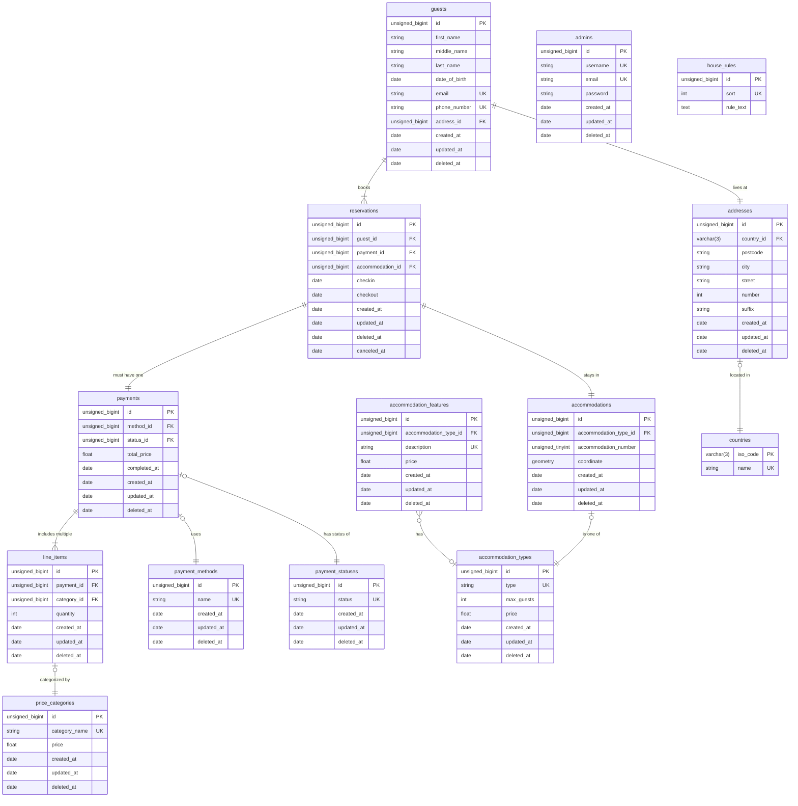

## Acceptatiecriteria

Omdat het lastig is om groter veranderingen aan te brengen in een database schema dat al
in gebruik is, is het belangrijk dat het schema goed ontworpen is. Een goed ontwerp
ondersteunt de functionaliteiten die vereist zijn voor de bedrijfsvoering. De
benodigdheden voor deze functionaliteiten zijn hieronder uitgedrukt als acceptatie
criteria.

- Voor administratieve en wettelijke doeleinden moeten de persoonsgegevens van de
  campingbezoekers geregistreerd worden.
- De klant (Boer Bert) wenst zelf zijn prijzen te kunnen aanpassen, en ook nieuwe soorten
  prijzen toe te kunnen voegen. Bijvoorbeeld service kosten.
- De klant heeft bevestigd dat er twee soorten accommodaties zijn om te reserveren,
  kampeerplekken en bungalows.
- De klant heeft aangegeven dat alle accommodaties van hetzelfde soort identiek zijn. Dus
  alle kampeerplekken zijn onderling hetzelfde en gelijkwaardig, en alle bungalows zijn
  onderling gelijkwaardig.
- Om te zorgen dat de software geen ingrijpende aanpassingen vereist als er in de toekomst
  iets in het aanbod van accommodaties veranderd, moet het voor de klant mogelijk zijn
  details hierover aan te passen. Als er bijvoorbeeld keukens geïnstalleerd worden in de
  bungalows, of als de klant een nieuw soort vaste tent gaat verhuren.
- Ook moet het mogelijk zijn voor de klant om zonder hulp van de ontwikkelaars zelfstandig
  de tekstuele inhoud van de huisregels aan te passen.
- De klant wil een afgeschermde website-omgeving te hebben, waarin de gewenste
  aanpassingen gemaakt kunnen worden.
- De klant wil inzichten kunnen krijgen uit de data over diens bedrijfsvoering. Het
  reserveringssysteem en de bijbehorende database moeten dus ontworpen zijn om relevante
  informatie te verzamelen, op te slaan, en te aggregeren, zodat daaruit inzichten opgedaan
  kunnen worden.

## Kwaliteitscriteria

- Er is voldaan aan ten minste de vierde normaalvorm [^norm].
- Alle namen zijn in het Engels, in kleine letters geschreven en met underscores om
  woorden van elkaar te scheiden (e.g. snake_case).
- Tabel namen zijn altijd in meervoud.
- Foreign key kolommen hebben altijd een naam in
  de vorm van _\<gerelateerde-naam-in-enkelvoud\>\_id_.
- Vereiste informatie die niet achterwege gelaten mag worden is aangegeven als `NOT NULL`.
- De juiste datatypes worden gebruikt voor de kolommen.

[^norm]: https://en.wikipedia.org/wiki/Database_normalization

Daarnaast gelden er enkele Kwaliteitscriteria op het diagram zelf.

- Het diagram wordt opgeleverd in de vorm van een diagram-as-code. Dit integreert het
  beste met verschillende tools, en is effectief op te slaan in versiebeheer, in
  tegenstelling tot een afbeelding.
- Het diagram geeft alle tabellen uit het ontwerp, en relaties daartussen, weer.

## Entity Relation Diagram

In dit diagram is het ontwerp van de database schema uitgebeeld. Een belangrijk doel van
het ontwerp is om complete persoonsgegevens op te slaan voor administratieve doeleinden en
om te voldoen aan de wet. Daarnaast moet het mogelijk zijn voor de beheerders van de
applicatie - Boer Bert zelf, of administratieve medewerkers - om operationele parameters
aan te passen. Bijvoorbeeld het aanbod van (soorten) accommodaties en de bijbehorende
(soorten) prijzen. Dit alles met zo min mogelijk duplicatie door middel van normalisatie
om data inconsistentie te voorkomen. Ook moeten historische gegevens intact blijven onder
bijvoorbeeld prijswijzigingen.

## Gevolgen voor stakeholders

Gezien de database het hart van de applicatie is, is het ontwerp daarvan bepalend voor
welke features de applicatie kan ondersteunen. Dit ontwerp is dus van belang voor de
product owner en diens communicatie naar de klant. Alle gegevens die worden opgeslagen
moeten ook ergens vandaan komen, namelijk uit de web frontend. Onze UI/UX designers en
frontend developers moeten dus op de hoogte zijn van welke gegevens er ingevoerd moeten
worden tijdens het reserveren. Dit brengt voor de frontend ontwikkelaar ook extra
complexiteit mee, omdat deze gegevens in real-time gevalideerd moeten worden voor een
goede gebruikerservaring. Persoonsgegevens zoals e-mailadressen en internationale
telefoonnummers en woonadressen/postcodes kunnen lastig zijn om te valideren.

## Oordeel over databaseontwerp

Het databaseontwerp houdt in het bijzonder rekening met opslaan van de noodzakelijke
gegevens voor het plaatsen van een reservering, en het mogelijk maken wijzigingen te maken
in bedrijfsmatige details, zoals prijzen of het aanbod van accommodaties.

De vereiste persoonsgegevens worden opgeslagen in de `guests` en `addresses` tabellen.
Mochten twee leden uit hetzelfde huishouden los van elkaar reserveren, hoeven de
adresgegevens niet gedupliceerd te worden. Daarnaast zorgt de scheiding in twee tabellen
voor overzichtelijkheid voor ontwikkelaars. `guests` Zijn gerelateerd aan `reservations`,
waardoor dezelfde gast meerdere reservering kan maken zonder duplicatie van diens
persoonsgegevens. Door op deze manier gebruik te maken van losse tabellen en relaties,
wordt er voldaan aan normalisatie, om zo de consistentie van de data te garanderen.

Aanpasbare prijzen worden mogelijk gemaakt door een `payments` tabel, die gerefereerd
wordt in de `line_items` tabel. De records uit deze tabel vormt een prijs opbouw die horen
bij een bepaalde factuur van een gegeven reservering. Doordat de "items" van een betaling
records zijn in een daarvoor ontworpen tabel, kunnen dergelijke "items" toegevoegd,
gewijzigd of verwijderd worden zonder structurele aanpassingen aan de database toe te
brengen. Records uit de `line_items` tabel ("items"), zijn gerelateerd aan records uit de
`price_categories` tabel. Ook in dit geval kunnen nieuwe prijscategorieën toegevoegd of
gewijzigd worden. Dit maakt het mogelijk om details over de bedrijfsvoering uit te drukken
als gewone data. De klant kan bijvoorbeeld een toeristenbelasting toevoegen, of service
kosten, of extra kosten voor het gebruik van faciliteiten. Dezelfde logica geldt ook voor
het aanpassen van de inhoud van de huisregels.

Dit soort toevoegingen en wijzigingen zijn voorbeelden van "create, read, update
& destroy" operaties. Dergelijke operaties zijn een standaard functie van (vrijwel) elke
SQL database, en vereisen geen wijzigingen in de structuur van de database die alleen door
een professional uitgevoerd kunnen worden, en niet door de klant zelf.

Voor het plaatsen van een reservering hoeven gasten geen account aan te maken. Na een
succesvol afgeronde reservering kunnen ze direct een overzicht printen of downloaden, en
ontvangen zij een bevestiging in hun e-mail.

De klant zelf gaat echter wel een account krijgen, waarmee zij in een privé-omgeving
kunnen inloggen. Deze privé-omgeving bevat een dashboard dat visuele inzage geeft in de
prestaties van het bedrijf. Ook kan de klant in deze omgeving op speciaal daarvoor
ontworpen pagina's wijzigingen aanbrengen aan de prijzen en aanbod van accommodaties. Deze
accountgegevens worden opgeslagen in de `admins` tabel. De `password` kolom bevat
uiteraard alleen een sterke cryptografische hash van het wachtwoord, niet het wachtwoord
zelf.

Een nadeel van het databaseontwerp rondom aanpasbare prijzen, is dat de benodigde
informatie voor het berekenen van de definitieve totaalprijs van de reservering verspreid
is over meerdere tabellen. Dit maakt de logica voor het berekenen van deze totaalprijs
minder eenduidig en moeilijker te implementeren in de applicatie. Dit kan als gevolg
hebben dat het toevoegen of aanpassen van functionaliteiten van de applicatie in de
toekomst verhinderd wordt.

Om te voorkomen dat data verloren gaat, wordt er in de database gebruik gemaakt van "soft
deletes". In de plaats van records rechtstreeks te verwijderen uit de tabellen, wordt de
record op non-actief gezet. De applicatie herkent non-actieve, en dus "verwijderde" data
doordat de `deleted_at` kolom een datum & tijd waarde bevat, die anders `NULL` is. Dit
maakt het mogelijk om een verwijdering ongedaan te maken. Als er voldoende tijd verstreken
is kan de data vervolgens echt uit de database verwijderd worden.

Ook zijn er `created_at` en `updated_at` kolommen toegevoegd aan elke tabel, om als
mogelijk nuttige informatie te dienen de ontwikkelaars om problemen op to lossen, mochten
deze zich voor doen. Ook vormt deze informatie extra context voor de klant. Zo kan hij
bijvoorbeeld zien wanneer een prijscategorie was aangemaakt, of voor het laatst aangepast.
