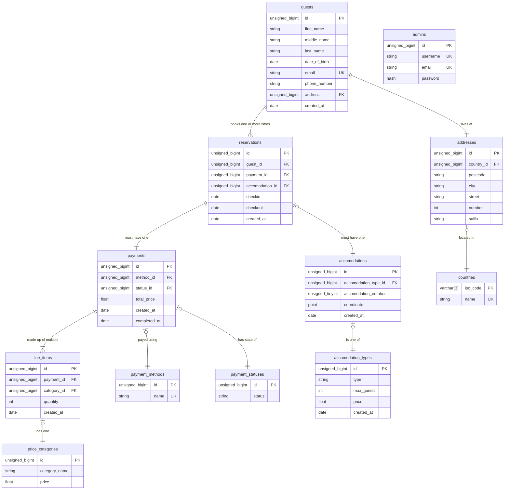

## Entity Relation Diagram

In dit diagram is het databasa schema ontwerp uitgebeeld. Een belangrijk doel van het
ontwerp is om complete persoonsgegevens op te slaan voor administratieve doeleinden en om
te voldoen aan de wet. Daarnaast moet het mogelijk zijn voor de beheerders van de
applicatie - Boer Bert zelf, of administratieve medewerkers - om operationele parameters
aan te passen. Bijvoorbeeld het aanbod van (soorten) accommodaties en de bijbehorende
(soorten) prijzen. Dit alles met zo min mogelijk duplicatie door middel van normalisatie
om data inconsistentie te voorkomen. Ook moeten historische gegevens intact blijven onder
bijvoorbeeld prijswijzigingen.

## Kwaliteitscriteria

-   Er is voldaan aan ten minste de vierde normaalvorm [^norm].
-   Alle namen zijn in het Engels, in kleine letters geschreven en met underscores om
    woorden van elkaar te scheiden (e.g. snake_case).
-   Tabel namen zijn altijd in meervoud.
-   Foreign key kolommen hebben altijd een naam in
    de vorm van _\<gerelateerde-naam-in-enkelvoud\>\_id_.

[^norm]: https://en.wikipedia.org/wiki/Database_normalization

## Gevolgen voor stakeholders

Gezien de database het hart van de applicatie is, is het ontwerp daarvan bepalend voor
welke features de applicatie kan ondersteunen. Dit ontwerp is dus van belang voor de
product owner en diens communicatie naar de klant. Alle gegevens die worden opgeslagen
moeten ook ergens vandaan komen, namelijk uit de web frontend. Onze UX/UI designers en
frontend developers moeten dus op de hoogte zijn van welke gegevens er ingevoerd moeten
worden tijdens het reserveren. Dit brengt voor de frontend ontwikkelaar ook extra
complexiteit mee, omdat deze gegevens in real-time gevalideerd moeten worden voor een
goede gebruikerservaring. Persoonsgegevens zoals e-mailadressen en internationale
telefoonnummers en woonadressen/postcodes kunnen lastig zijn om te valideren.
